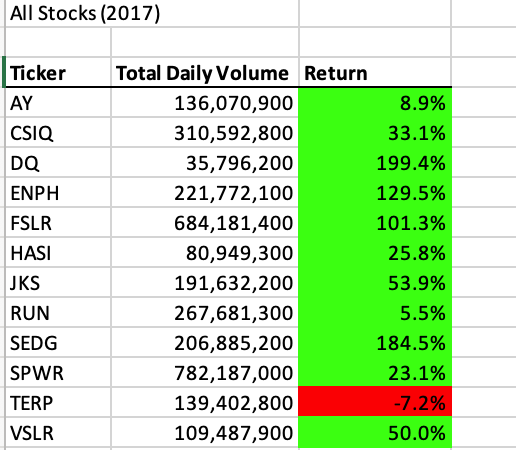
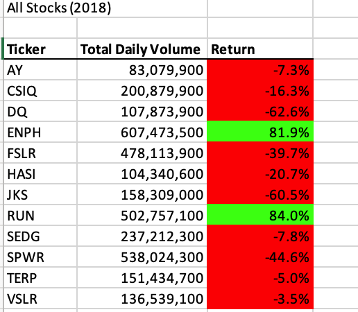
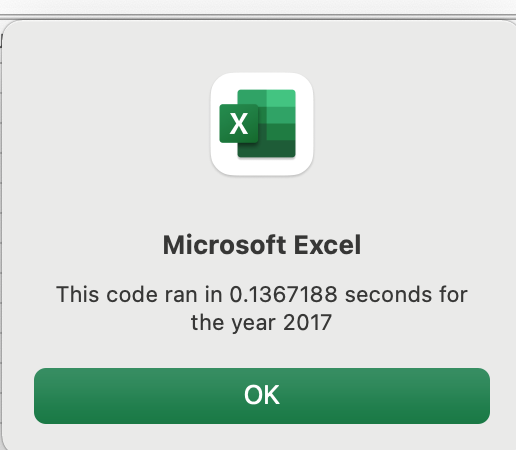
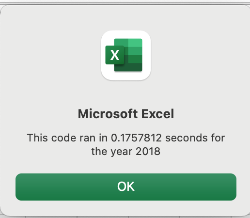

# stockanalysis
Overview of Project:

In this challenge, I am helping Steve to find out best investment options for his parents based on the spreadsheets he has shared.

Based on initial analysis work I provided, he realized Daqo would not be the smart choice to invest with 63% value dropped in 2018. He will want to search for better options for his parents. He wanted to apply the same analysis to entire stock market for couple of years. As part of the challenge, I have refactored the code, so large data sets could be handled and execution time for each analysis set is displayed with a user friendly message box.

Results:

For the year 2017, most stocks did return positive ROI except one that is TERP at the -7.2 % loss.

For the year 2018, unfortunately, more stocks did fail including DQ. Only two stocks proved to be a good investment, ENPH and RUN, both over 80% return.

With refactored code, the execution time for the analysis took only 0.136 seconds for the 2017, whereas the original script, it was 0.535 seconds.

With refactored code, the execution time for the year 2018 was only 0.175 seconds, whereas in the original script, it was 0.734 seconds.

Summary:

Refactoring code has improved the performance and will be valuable as the amount of data gets larger.

Sub AllStocksAnalysisRefactored()

    Dim startTime As Single
    Dim endTime  As Single

    yearValue = InputBox("What year would you like to run the analysis on?")

    startTime = Timer

    'Format the output sheet on All Stocks Analysis worksheet
    Worksheets("All Stocks Analysis").Activate

    'Title Analysis
    Range("A1").Value = "All Stocks (" + yearValue + ")"

    'Create a header row
    Cells(3, 1).Value = "Ticker"
    Cells(3, 2).Value = "Total Daily Volume"
    Cells(3, 3).Value = "Return"

    'Initialize array of all tickers
    Dim tickers(12) As String

    tickers(0) = "AY"
    tickers(1) = "CSIQ"
    tickers(2) = "DQ"
    tickers(3) = "ENPH"
    tickers(4) = "FSLR"
    tickers(5) = "HASI"
    tickers(6) = "JKS"
    tickers(7) = "RUN"
    tickers(8) = "SEDG"
    tickers(9) = "SPWR"
    tickers(10) = "TERP"
    tickers(11) = "VSLR"

    'Activate data worksheet
    Worksheets(yearValue).Activate

    'Count the number of rows to loop over
    RowCount = Cells(Rows.Count, "A").End(xlUp).Row

    '1a) Create a ticker index to reference proper ticker in the arrays.
    Dim tickerIndex As Integer
    tickerIndex = 0 'Initiate tickerIndex at zero.

    '1b) Create three output arrays
    Dim tickerVolumes(12) As Long
    Dim tickerStartingPrices(12) As Single
    Dim tickerEndingPrices(12) As Single

    '2a) Create for loop to analyze each ticker in the array.
    For tickerIndex = 0 To 11
    tickerVolumes(tickerIndex) = 0 'Initiate each ticker's volume at zero.

    'Activate data worksheet
    Worksheets(yearValue).Activate

        '2b) Loop over all the rows in the spreadsheet.
            For i = 2 To RowCount

                    '3a) Increase volume for current ticker.
                    tickerVolumes(tickerIndex) = tickerVolumes(tickerIndex) + Cells(i, 8).Value

                    '3b) Check if the current row is the first row with the current ticker.
                    If Cells(i, 1).Value = tickers(tickerIndex) And Cells(i - 1, 1).Value <> tickers(tickerIndex) Then
                        'if it is the first row for current ticker, set starting price.
                        tickerStartingPrices(tickerIndex) = Cells(i, 6).Value
                    End If

                '3c) Check if the current row is the last row with the current ticker.

                    If Cells(i, 1).Value = tickers(tickerIndex) And Cells(i + 1, 1).Value <> tickers(tickerIndex) Then
                        'if it is the last row for current ticker, set ending price.
                        tickerEndingPrices(tickerIndex) = Cells(i, 6).Value
                    End If

                '3d) Check if the current row is the last row with the current ticker.
                    If Cells(i, 1).Value = tickers(tickerIndex) And Cells(i + 1, 1).Value <> tickers(tickerIndex) Then
                        'increase tickerIndex to move on to next ticker in array.
                        tickerIndex = tickerIndex + 1
                    End If

            Next i

    Next tickerIndex

    '4) Loop through your arrays to output the Ticker, Total Daily Volume, and Return.

    For i = 0 To 11

        'Activate Output Worksheet
        Worksheets("All Stocks Analysis").Activate

        'Ticker Row Label
        Cells(4 + i, 1).Value = tickers(i)

        'Sum of Volume
        Cells(4 + i, 2).Value = tickerVolumes(i)

        'ReturnValue
        Cells(4 + i, 3).Value = tickerEndingPrices(i) / tickerStartingPrices(i) - 1

    Next i

    'Formatting
    Worksheets("All Stocks Analysis").Activate
    Range("A3:C3").Font.FontStyle = "Bold"
    Range("A3:C3").Borders(xlEdgeBottom).LineStyle = xlContinuous
    Range("B4:B15").NumberFormat = "#,##0"
    Range("C4:C15").NumberFormat = "0.0%"
    Columns("B").AutoFit

    dataRowStart = 4
    dataRowEnd = 15

    For i = dataRowStart To dataRowEnd
         If Cells(i, 3) > 0 Then
             Cells(i, 3).Interior.Color = vbGreen
        Else
             Cells(i, 3).Interior.Color = vbRed
         End If
    Next i

    endTime = Timer
    MsgBox "This code ran in " & (endTime - startTime) & " seconds for the year " & (yearValue)

End Sub

How do these pros and cons apply to refactoring the original VBA script?

I do not think there are any cons to apply for refactoring. Code written initially can always be fine tuned, documented more or clearly, or simply refactored. Pros are more in this effort to fine tune original coding.
# stockanalysis
Second challenge of the data analytics bootcamp
